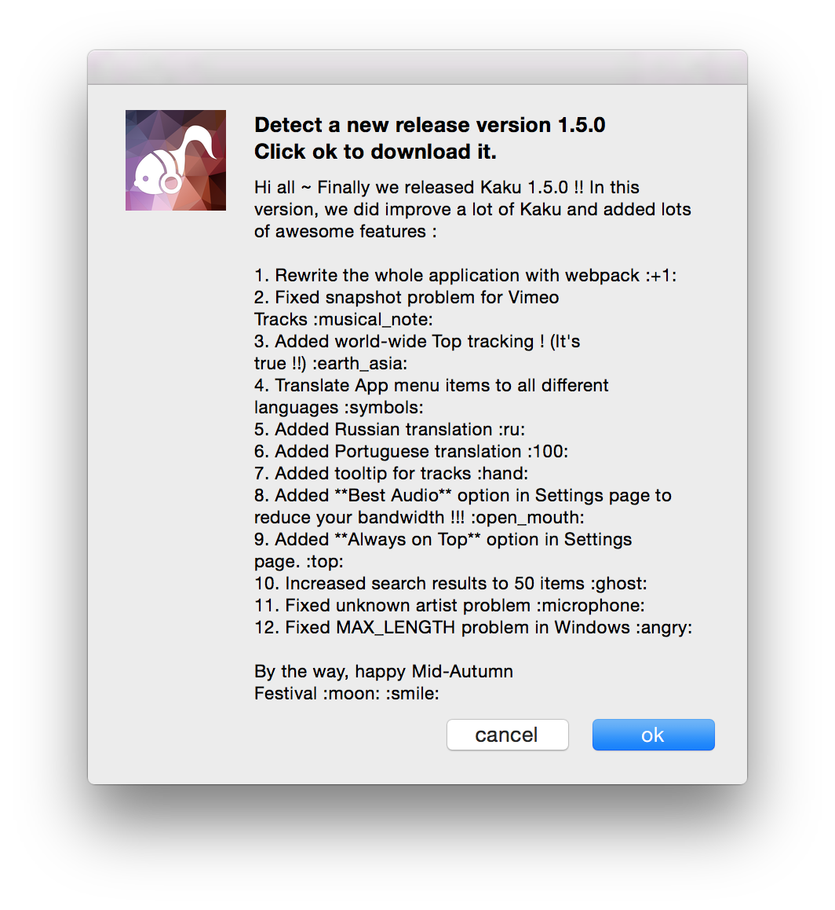

# AutoUpdater

## 想要在你的程式裡面加入內建的 AutoUpdater ?

別傻了孩子，要使用 Electron 內建的 AutoUpdater 有兩個很大的前提：

1. **你要有該死的 Key 來 Sign 你的程式**。**Windows 或是 Mac OS 的 build** 需要各自的 Key。以 Mac OS 來說，你要一年先花三千大洋買個開發者帳號，之後你才有辦法拿這個 Key 來 Sign 你的程式。如果是公司／企業的話，這個流程又更麻煩了，因為你要先拿到[白氏碥碼又稱（DUNS）](https://developer.apple.com/support/D-U-N-S/)才可以註冊公司帳號，才能用公司的角色發佈，我曾經和朋友跑過一次註冊公司帳號的流程，只能說超麻煩！！
2. 你要有一個 Server 動態的提供 [Squirrel 看得懂的格式](https://github.com/Squirrel/Squirrel.Mac#update-json-format)如下，然後你還要提供一個空間存放你每次新版本的 build 讓他去抓。
```json
{
    "url": "http://mycompany.com/myapp/releases/myrelease",
    "name": "My Release Name",
    "notes": "Theses are some release notes innit",
    "pub_date": "2013-09-18T12:29:53+01:00",
}
```

因為上面這兩件事情（特別是拿到 Key 這件事）真的很麻煩，所以我到現在都還沒真的成功試用他內建的 AutoUpdater ... 所以有關內建 AutoUpdater 的注意事項就先留到下下下下次了。但是我們的程式還是需要自動更新呀！那怎麼辦？

我目前個人的做法是透過 [Github Releases](https://github.com/EragonJ/Kaku/releases) 來放我的程式，然後程式內部有個小型的 [AutoUpdater](https://github.com/EragonJ/Kaku/blob/master/src/modules/AutoUpdater.js) 會自動透過 Github API 爬出最新的 Release 內容，當偵測到有新版出現的時候，程式就會自動跳出要使用者下載新版本的視窗，當點擊的時候就會自動把使用者導到下載連結自動下載，同時關閉程式，算是一個還可以接受的中間做法！而效果就像下面這張圖一樣：



### 備註

1. 這個作法唯一的小缺點就是使用者要多做一次「解壓縮」的動作並覆蓋舊的程式。
2. 預設的 AutoUpdater 官方目前只支援 Mac OS ，而 Windows 的部份雖然也已經有了但是還沒被整合進去 Electron ，所以需要額外做一些設定。

### 補充資料

1. http://www.pracucci.com/atom-electron-signing-mac-app.html
2. https://github.com/Squirrel/Squirrel.Mac
3. https://github.com/Squirrel/Squirrel.Windows
4. https://github.com/atom/electron/blob/master/docs/api/auto-updater.md
